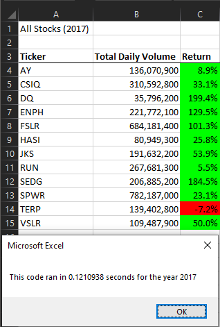
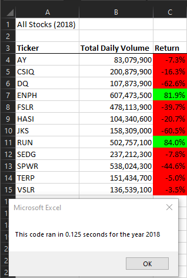

# Stock Analysis

## Overview of Project
We're refactoring a previous excel sheet that allowed you to look at a set of stock data and analyse those stocks. We need to refactor the code to allow it to work more efficiently and only loop through the stock data once instead of going through all the data for every separate stock. This is to help our friend Steve expand on his previous ask of analyzing stocks to allow him to potentially look through more stock data faster and more efficiently than before

## Results
### Timing
Before refactoring the code it would take anywhere from a couple seconds to sometimes going a little over 10 seconds. Now I have yet to run the code and have it take longer than 0.2 seconds, usually taking ~0.10-0.15 seconds:
|VBA Challenge 2017|VBA Challenge 2018|
|||
|||

### Code Changes
Before we had setup the code to run through an array of stock codes and for each stock it would run through all the stock data we had and return the relevant stock data to us. We used a nested for loop for this with the parent for loop going through the stock codes and the child loop going through the whole data set for each stock code:
```
    For i = 0 To 11
        'set variables for each loop through the rows
        totalVolume = 0
        ticker = tickers(i)
        
        'loop over all the rows, once for each ticker
        For j = 2 To RowCount
            Worksheets("2018").Activate
            
            If Cells(j, 1).Value = ticker Then
                'increase totalVolume if current ticker
                totalVolume = totalVolume + Cells(j, 8).Value
            End If

            If Cells(j, 1).Value = ticker And Cells(j - 1, 1).Value <> ticker Then
                'set starting price of current ticker
                startingPrice = Cells(j, 6).Value
            End If
    
            If Cells(j, 1).Value = ticker And Cells(j + 1, 1).Value <> ticker Then
                'set ending price of current ticker
                endingPrice = Cells(j, 6).Value
            End If
    
        Next j
        
    Worksheets("All Stocks Analysis").Activate
    Cells(4 + i, 1).Value = ticker
    Cells(4 + i, 2).Value = totalVolume
    Cells(4 + i, 3).Value = endingPrice / startingPrice - 1
    Next i
```
To speed this up and only require a single loop through all the data we changed the code to use arrays so we could loop through the arrays as we went through each row in the data and change the stock we were looking at depending on the row:
```
    For i = 2 To RowCount
    
        '3a) Increase volume for current ticker
        tickerVolumes(tickerIndex) = tickerVolumes(tickerIndex) + Cells(i, 8).Value
        
        '3b) Check if the current row is the first row with the selected tickerIndex.
        If Cells(i, 1).Value = tickers(tickerIndex) And Cells(i - 1, 1).Value <> tickers(tickerIndex) Then
            'if it matches set starting price
            tickerStartingPrices(tickerIndex) = Cells(i, 6).Value
        End If
        
        '3c) check if the current row is the last row with the selected ticker
        If Cells(i, 1).Value = tickers(tickerIndex) And Cells(i + 1, 1).Value <> tickers(tickerIndex) Then
            'if it's the last  row with the ticker, set the ending price
            tickerEndingPrices(tickerIndex) = Cells(i, 6).Value
            
            '3d) and increase the tickerIndex.
            tickerIndex = tickerIndex + 1
        End If
    
    Next i
```
And then we use a separate for loop to output the data we collected in the separate arrays

## Summary
### Advantages
This new setup allows for the macro to run very efficiently and quickly allowing it to chew through large amounts of data quickly. The original would require an additional run through the whole data set for every new stock you want to check and the data set would only get bigger as well, while the refactored code will only need to run through the additional lines added to the data set.
### Disadvantages
Because of how the for loops are setup, the sorting of the stock data set has a huge impact. If we change the dates to not be chronological it will mess up the Return and if we don’t have all the data for each stock grouped together it will mess up even more.
### Conclusion
The disadvantage was already prevalent in the original code while the advantage of this refactored code is very telling. It’s a large improvement in almost all cases this would be required.
